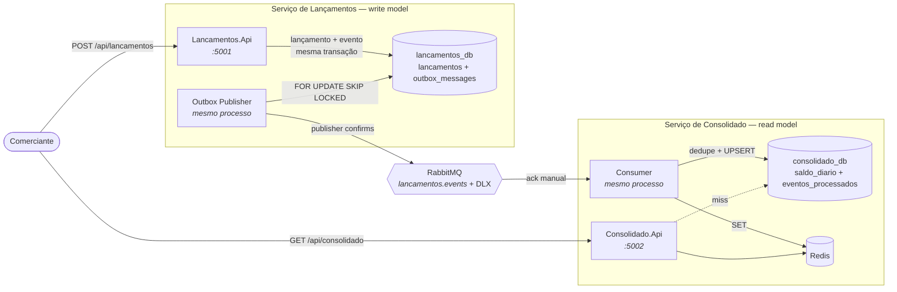

# Cashflow — Controle de Fluxo de Caixa

Sistema de controle de fluxo de caixa diário para comerciantes: um serviço
registra os lançamentos (débitos e créditos) e outro serve o saldo diário
consolidado.

> **A frase que define todo o desenho:**
> o serviço de controle de lançamentos **não** pode ficar indisponível se o
> serviço de consolidado diário cair.

Os dois casos de uso cabem numa aplicação com duas tabelas. É a restrição acima
que não cabe — e ela é atendida de forma **estrutural** (dois serviços, dois
bancos, comunicação assíncrona) e **comprovada por teste executável**, não por
argumento:

```bash
dotnet test src/tests-e2e/Cashflow.E2E.slnx --filter FullyQualifiedName~ResilienciaTests
```

Um segundo requisito completa o quadro: no pico, o consolidado recebe 50 req/s
tolerando até 5% de perda. Essa tolerância é tratada como **error budget
explícito**, que autoriza degradação controlada em vez da busca por
disponibilidade total.

**A conclusão que reposiciona o problema:** 50 req/s é uma carga baixa para um
lookup por chave primária — uma instância .NET opera na casa dos milhares. O
desafio aqui não é throughput, é **isolamento de falha**. Cache, circuit breaker
e rate limiting existem para proteger a latência de cauda e o error budget
quando uma dependência degrada, não para dar conta do volume. A conta está em
[`docs/slos.md`](docs/slos.md).

---

## Sumário

- [Arquitetura](#arquitetura)
- [Como rodar](#como-rodar)
- [Roteiro de 2 minutos](#roteiro-de-2-minutos)
- [Como testar](#como-testar)
- [Decisões arquiteturais](#decisões-arquiteturais)
- [SLOs e capacidade](#slos-e-capacidade)
- [Modos de falha](#modos-de-falha)
- [Segurança](#segurança)
- [O que eu faria com mais tempo](#o-que-eu-faria-com-mais-tempo)
- [Estrutura do repositório](#estrutura-do-repositório)

---

## Arquitetura

Microsserviços com CQRS e comunicação orientada a eventos. Lançamentos é o
*write model* e a fonte da verdade; Consolidado mantém uma projeção agregada
(*read model*) atualizada de forma assíncrona.



**Não existe seta de Lançamentos para Consolidado.** A única ligação entre os
domínios é a fila — não há chamada para falhar, timeout para propagar nem
circuit breaker a configurar entre os dois. É isso que torna o isolamento
estrutural em vez de convencional.

Os três diagramas completos — C4 nível 1 e 2, sequência do caminho feliz e
sequência dos dois cenários de falha — estão em
[`docs/arquitetura.md`](docs/arquitetura.md).

### Padrões aplicados

| Preocupação | Padrão | Onde |
|---|---|---|
| Não perder evento numa falha parcial | **Transactional Outbox** | lançamento e evento no mesmo `COMMIT` |
| Publicar sem duplicar entre réplicas | `FOR UPDATE SKIP LOCKED` | `OutboxPublisherBackgroundService` |
| Broker entrega *at-least-once* | **consumidor idempotente** (dedupe por `eventId`) | mesma transação do `UPSERT` |
| Retry do cliente não duplicar | `Idempotency-Key` + índice único por comerciante | `CriarLancamentoCommandHandler` |
| Corrigir um lançamento | **estorno** (lançamento compensatório), nunca `UPDATE`/`DELETE` | `Lancamento.Estornar` |
| Banco lento não empilhar requisição | **circuit breaker + timeout** (Polly) | consulta do Consolidado |
| Separar comando de consulta | **CQRS** macro (dois serviços) e micro (handlers) | camada Application |
| Regra de negócio no lugar certo | **DDD tático** — VOs `Dinheiro`/`Moeda`, entidade `Lancamento` | camada Domain |

### Stack

.NET 10 (C# 14) com Minimal API · Dapper + Npgsql · PostgreSQL (um por serviço)
· RabbitMQ · Redis · Polly · Docker Compose · xUnit + FluentAssertions +
Testcontainers

---

## Como rodar

**Pré-requisito:** Docker (com Compose v2). Nada mais — o .NET SDK só é
necessário para rodar os testes.

```bash
git clone https://github.com/danielcruzdev/dotnet-cqrs-cashflow.git
cd dotnet-cqrs-cashflow
docker compose up --build
```

Sobe seis contêineres: os dois bancos, o broker, o Redis e as duas APIs. A
primeira execução compila as imagens .NET e leva alguns minutos; as seguintes
são imediatas.

| Serviço | Endereço |
|---|---|
| API de Lançamentos | http://localhost:5001 |
| API de Consolidado | http://localhost:5002 |
| Console do RabbitMQ | http://localhost:15672 — `cashflow` / `cashflow_dev` |
| `lancamentos_db` | `localhost:5432` — `cashflow` / `cashflow_dev` |
| `consolidado_db` | `localhost:5433` — `cashflow` / `cashflow_dev` |

Verificação rápida de que subiu:

```bash
curl http://localhost:5001/health/ready
curl http://localhost:5002/health/ready
```

> **Não há Swagger.** O pacote `Microsoft.AspNetCore.OpenApi` arrasta uma versão
> de `Microsoft.OpenApi` com CVE conhecido, e a versão corrigida quebra a API do
> source generator que o acompanha. Com auditoria de vulnerabilidade tratada
> como erro de build, a saída correta foi não expor OpenAPI nesta versão em vez
> de suprimir o aviso. A API é exercitável pelo roteiro abaixo e pelos arquivos
> `lancamentos.http` e `consolidado.http`, versionados junto de cada API e
> cobrindo os casos de borda de cada endpoint.

---

## Roteiro de 2 minutos

**1. Obter um token.** O emissor local vive no serviço de Lançamentos.

```bash
COMERCIANTE=11111111-1111-1111-1111-111111111111

TOKEN=$(curl -s -X POST http://localhost:5001/api/token \
  -H 'Content-Type: application/json' \
  -d "{\"comercianteId\":\"$COMERCIANTE\"}" | sed -E 's/.*"token":"([^"]+)".*/\1/')
```

**2. Registrar um crédito.**

```bash
curl -i -X POST http://localhost:5001/api/lancamentos \
  -H "Authorization: Bearer $TOKEN" \
  -H 'Content-Type: application/json' \
  -H 'Idempotency-Key: venda-001' \
  -d "{\"comercianteId\":\"$COMERCIANTE\",\"tipo\":\"CREDITO\",\"valor\":700.00,\"moeda\":\"BRL\",\"dataCompetencia\":\"$(date +%F)\",\"descricao\":\"Venda balcão\"}"
```

→ `201 Created` com `Location` para o recurso.

**3. Repetir exatamente a mesma requisição.**

→ `200 OK` com **o mesmo** lançamento. Nada foi criado. Trocar o valor mantendo
a chave devolve `409 Conflict`.

**4. Registrar um débito e consultar o saldo.**

```bash
curl -s -X POST http://localhost:5001/api/lancamentos \
  -H "Authorization: Bearer $TOKEN" -H 'Content-Type: application/json' \
  -H 'Idempotency-Key: despesa-001' \
  -d "{\"comercianteId\":\"$COMERCIANTE\",\"tipo\":\"DEBITO\",\"valor\":320.50,\"moeda\":\"BRL\",\"dataCompetencia\":\"$(date +%F)\"}" > /dev/null

sleep 3   # consistência eventual: SLO de lag p95 < 5 s

curl -s "http://localhost:5002/api/consolidado/$COMERCIANTE/$(date +%F)" \
  -H "Authorization: Bearer $TOKEN"
```

```json
{
  "comercianteId": "11111111-1111-1111-1111-111111111111",
  "data": "2026-07-26", "moeda": "BRL",
  "totalDebitos": 320.50, "totalCreditos": 700.00,
  "saldo": 379.50, "qtdLancamentos": 2,
  "atualizadoEm": "2026-07-26T22:14:03.118Z"
}
```

**5. Tentar ler o saldo de outro comerciante** com o mesmo token → `403
Forbidden`. É a autorização por recurso, sem a qual qualquer portador de token
válido leria o caixa de qualquer um.

### Endpoints

| Método | Rota | Serviço |
|---|---|---|
| `POST` | `/api/token` | Lançamentos — emissor de desenvolvimento, anônimo |
| `POST` | `/api/lancamentos` | Lançamentos — exige `Idempotency-Key` |
| `GET` | `/api/lancamentos?comercianteId=&dataInicio=&dataFim=&pagina=&tamanhoPagina=` | Lançamentos — paginado |
| `GET` | `/api/lancamentos/{id}?comercianteId=` | Lançamentos |
| `POST` | `/api/lancamentos/{id}/estorno?comercianteId=` | Lançamentos |
| `GET` | `/api/consolidado/{comercianteId}/{data}?moeda=BRL` | Consolidado |
| `GET` | `/api/consolidado/{comercianteId}?de=&ate=&moeda=BRL` | Consolidado — máx. 90 dias |
| `GET` | `/health/live`, `/health/ready` | ambos — anônimos |

O `comercianteId` aparece na rota ou na query string de todos os endpoints de
negócio, e é sempre conferido contra a claim do token — é a checagem que fecha o
IDOR. Erros seguem `ProblemDetails` (RFC 7807) e trazem um `codigo` estável como
extensão, para o cliente ramificar sem fazer parse de mensagem.

---

## Como testar

```bash
# Unidade — regras de domínio dos dois serviços. Não precisam de Docker.
dotnet test src/lancamentos-service/Lancamentos.slnx
dotnet test src/consolidado-service/Consolidado.slnx

# Ponta a ponta e resiliência — sobem a própria infraestrutura via Testcontainers
dotnet test src/tests-e2e/Cashflow.E2E.slnx
```

Os testes E2E **não dependem do `docker compose up`**: a fixture sobe os quatro
contêineres por conta própria e aplica os **mesmos** `01-schema.sql` e
`definitions.json` que o compose usa — se o teste tivesse schema próprio,
passaria descrevendo um ambiente que não existe. Basta ter um Docker rodando. A
primeira execução baixa quatro imagens.

| O que é provado | Teste |
|---|---|
| Lançamento chega ao saldo diário | `LancamentoRegistradoChegaAoSaldoDiario` |
| Dia sem lançamentos devolve zeros, não `404` | `DiaSemLancamentosRespondeZerosENao404` |
| Estorno zera o saldo sem apagar a movimentação bruta | `EstornoZeraOSaldoSemApagarAMovimentacao` |
| Mesma `Idempotency-Key` + mesmo payload não duplica | `MesmaChaveComMesmoPayloadNaoDuplica` |
| Mesma chave + payload diferente é `409` | `MesmaChaveComPayloadDiferenteEhConflito` |
| Reentrega do mesmo `eventId` não soma duas vezes | `EventoReentregueNaoSomaDuasVezes` |

### O teste de resiliência

É o entregável de maior valor do projeto: o único artefato que **prova** o
requisito principal em vez de argumentar sobre ele.

```bash
dotnet test src/tests-e2e/Cashflow.E2E.slnx --filter FullyQualifiedName~ResilienciaTests
```

**`ConsolidadoForaDoArNaoImpedeLancamentoEOSaldoConvergeNaVolta`** descarta o
host do Consolidado — API e consumer caem juntos, porque rodam no mesmo processo
— registra cinco lançamentos e exige `201` em todos. Depois confere **por SQL**
que `saldo_diario` continua vazio enquanto o serviço está fora (sem essa
asserção, a convergência do final poderia ser uma corrida ganha por um consumer
que nunca morreu), sobe o serviço e assere que o saldo converge para o valor
correto.

**`BrokerForaDoArNaoImpedeLancamentoENenhumEventoSePerde`** faz o mesmo parando o
contêiner do RabbitMQ: cinco `201` com o broker fora, cinco linhas pendentes na
outbox, e a outbox drena com o saldo convergindo na volta. É o benefício menos
óbvio do Outbox — sem ele, o broker seria dependência síncrona da escrita.

---

## Decisões arquiteturais

| ADR | Decisão | O trade-off registrado |
|---|---|---|
| [0001](docs/adr/0001-separacao-em-microsservicos.md) | Dois microsserviços | Monolito modular seria mais simples e daria consistência forte de graça — descartado porque o isolamento passaria a depender de disciplina, não de topologia |
| [0002](docs/adr/0002-comunicacao-assincrona-via-broker.md) | Comunicação assíncrona via broker | Ganha isolamento, paga com entrega *at-least-once* e um componente a operar |
| [0003](docs/adr/0003-cqrs-e-transactional-outbox.md) | CQRS + Transactional Outbox | Nenhum evento se perde, mas **pode duplicar** — e é o dedupe do consumidor que fecha |
| [0004](docs/adr/0004-rabbitmq-vs-kafka.md) | RabbitMQ, não Kafka | Kafka é certo quando o log particionado *é* o produto; aqui há um consumidor e um tipo de evento |
| [0005](docs/adr/0005-rest-json-vs-grpc-protobuf.md) | REST+JSON na borda e no evento | Perde contrato gerado; ganha mensagem legível na DLQ, que é o que importa quando algo dá errado |
| [0006](docs/adr/0006-consistencia-eventual-aceita.md) | **Consistência eventual aceita** | O ADR central: a janela é quantificada em ~2,2 s de pior caso normal contra SLO de 5 s |
| [0007](docs/adr/0007-dapper-vs-ef-core.md) | Dapper, não EF Core | Sem migrations; em troca, `SKIP LOCKED`, `ON CONFLICT` e `RETURNING` explícitos |
| [0008](docs/adr/0008-sem-api-gateway-agora.md) | Sem API Gateway | Com dois serviços, um gateway é um SPOF na frente de um sistema cujo requisito é isolamento de falha |
| [0009](docs/adr/0009-handlers-proprios-vs-mediatr.md) | Handlers próprios, não MediatR | Licenciamento comercial nas versões recentes + o padrão fica visível |

Documentação de apoio: [arquitetura](docs/arquitetura.md) ·
[modelo de dados, contratos e eventos](docs/modelo-dados-contratos-eventos.md) ·
[SLOs e capacidade](docs/slos.md) · [runbook operacional](docs/runbook.md)

---

## SLOs e capacidade

| # | SLI | SLO | Status nesta entrega |
|---|---|---|---|
| 1 | Disponibilidade do `POST /api/lancamentos` | 99,5% (99,9% com réplica do banco) | 🎯 meta de produção |
| 2 | Disponibilidade do `GET /api/consolidado` no pico | ≥ 95% sob 50 rps | 🎯 meta — k6 não executado |
| 3–5 | Latências p95/p99 de consulta e p95 de escrita | < 100 ms / < 300 ms / < 150 ms | 🎯 meta — k6 não executado |
| 6 | **Lag de consistência eventual (p95)** | **< 5 s** | ✅ instrumentado no consumer |
| 7 | Perda de eventos | 0 | ✅ teste automatizado |
| 8 | Divergência de saldo | 0 | ⚠️ query manual no [runbook](docs/runbook.md) |
| 9–10 | RPO / RTO do Consolidado | 0 / < 5 min | ✅ teste de resiliência |

A coluna de status é deliberada: distingue o que a entrega **comprova** do que
ela **declara como meta**. Publicar dez SLOs sem dizer quais têm instrumentação
seria promessa vazia. Detalhamento, decomposição da janela de consistência e
análise de capacidade em [`docs/slos.md`](docs/slos.md).

---

## Modos de falha

| Falha | Lançamentos | Consolidado | Mitigação |
|---|---|---|---|
| API do Consolidado fora | **nenhum impacto** | consultas indisponíveis | requisito âncora garantido por design; readiness independente |
| Consumer fora | **nenhum impacto** | saldo congela no último evento | fila durável acumula; converge ao voltar (RPO 0) |
| `consolidado_db` fora | **nenhum impacto** | cache até o TTL, depois `503` | circuit breaker + cache, dentro do error budget |
| RabbitMQ fora | **nenhum impacto** | saldo congela | outbox retém e republica ao voltar |
| Redis fora | **nenhum impacto** | consultas mais lentas | degrada para o banco com log de `Warning`; fora do readiness |
| **`lancamentos_db` fora** | **serviço indisponível** ⚠️ | nenhum imediato | **SPOF assumido** — mitigação real é réplica com failover, fora do escopo |
| Evento envenenado | nenhum | uma mensagem parada | `nack` sem requeue → DLQ + procedimento no runbook |
| Publisher duplica evento | nenhum | nenhum | dedupe por `eventId` — *at-least-once* tratado |
| Perda do `consolidado_db` | nenhum | read model perdido | replay da outbox retida (runbook §5) |

Declarar o SPOF do `lancamentos_db` em vez de escondê-lo é deliberado: o
requisito é isolamento **em relação ao Consolidado**, e saber exatamente onde o
sistema ainda é frágil vale mais que um diagrama sem pontos fracos.

**Uma armadilha que valeu registrar:** o `/health/ready` do Lançamentos verifica
**apenas o próprio Postgres**. Se verificasse o RabbitMQ, uma queda do broker
faria o serviço se declarar not-ready, o orquestrador o tiraria do balanceador e
as escritas parariam — o health check derrubaria sozinho o requisito que a
outbox existe para garantir. E o `/health/live` não executa verificação nenhuma:
liveness derruba contêiner, readiness só desvia tráfego.

---

## Segurança

- **JWT em todos os endpoints de negócio.** Chave simétrica compartilhada pelos
  dois serviços, com emissor local em `/api/token` para o desafio rodar sem
  infraestrutura extra.
- **Autorização por recurso.** O `comercianteId` da rota, da query string ou do
  corpo é sempre comparado com a claim do token; divergência devolve `403` em
  `ProblemDetails`. Sem isso, qualquer portador de token válido leria o saldo de
  qualquer comerciante — é o IDOR, a falha mais comum em API multi-tenant. A
  checagem é repetida explicitamente nos seis endpoints em vez de escondida num
  filtro: um endpoint novo que esquecê-la aparece no diff.
- **Rate limiting só no Consolidado**, particionado pela claim do comerciante
  (não pelo IP, que colapsaria todos os clientes atrás de um NAT numa partição
  só). Limitar a escrita contradiz o requisito âncora — o serviço de lançamentos
  existe para continuar aceitando.
- **CORS deny-by-default**, com a lista de origens vazia em configuração:
  liberar um front-end é uma linha de `appsettings`, não uma decisão
  redescoberta no meio de um incidente.
- **Security headers** (`X-Content-Type-Options`, `X-Frame-Options`,
  `Referrer-Policy`) e `ProblemDetails` sem stack trace.
- **Injeção de SQL eliminada por construção**: todo acesso é por consulta
  parametrizada no Dapper, sem concatenação.
- **Limite de superfície**: período consultável limitado a 90 dias e tamanho de
  descrição e de chave de idempotência validados.

**Furo consciente, documentado:** `/api/token` é mapeado em qualquer ambiente,
não só em desenvolvimento. Restringi-lo seria mais defensável no papel, mas
esconderia o endpoint de quem só roda `docker compose up` seguindo este README.
O fechamento correto é o IdP externo — primeiro item da trilha de segurança
abaixo.

---

## O que eu faria com mais tempo

**Segurança**

- **IdP externo** (Keycloak ou Entra ID) com chave assimétrica e validação por
  JWKS: nenhum serviço guardaria segredo de assinatura, e o emissor local sairia
  do código. É o primeiro item da lista.
- Autorização por escopo (`lancamentos:write`, `consolidado:read`) além da
  verificação por recurso; TLS terminando nos serviços; segredos em Key Vault ou
  Kubernetes Secrets.

**Confiabilidade**

- **Réplica com failover para o `lancamentos_db`**, eliminando o SPOF declarado
  na matriz de falhas — é o que leva o SLO nº 1 de 99,5% para 99,9%.
- **Teto de redelivery no consumer** via `x-death`: hoje uma falha permanente do
  banco faz a mensagem circular indefinidamente.
- **Tratamento de `BasicReturn`** no publisher, para que mensagem sem rota deixe
  de ser descarte silencioso quando o broker não estiver provisionado pelo
  `definitions.json`.
- **`routing_key` como coluna da outbox**, apagando o `switch` sobre
  `tipo_evento` no publisher — transporte não deveria interpretar a carga.

**Observabilidade**

- **OpenTelemetry + Prometheus/Grafana**, com alerta automático quando o error
  budget de 5% ou o lag de 5 s forem violados. Os SLOs e os alertas já estão
  definidos em [`docs/slos.md`](docs/slos.md); falta a instrumentação de
  exportação — o lag já é um `Histogram` do `System.Diagnostics.Metrics`, então
  trocar isso vira configuração, não mudança de código.
- **Teste de carga k6** com 50 rps sustentados, fechando os SLOs 2 a 5.

**Dados e escala**

- **Job de reconciliação automático**, promovendo a query do runbook a
  verificação periódica com alerta.
- **Migrations com DbUp ou Flyway** — hoje o schema só é aplicado na criação do
  volume.
- **Expurgo de `outbox_messages` e `eventos_processados`** com janela de
  retenção; **tabela shadow** para reconstruir o read model sem downtime;
  **particionamento do `saldo_diario`** por período.
- **Event Sourcing completo** no write model. Não feito porque a retenção da
  outbox já entrega replay a uma fração do custo.
- **Multi-moeda com conversão** por taxa da data de competência — hoje cada
  moeda acumula um saldo isolado, por decisão explícita de escopo.
- **Kubernetes com HPA baseado no backlog da fila** (não em CPU) e **API
  Gateway**, ambos quando o número de serviços justificar.

**Separar o consumer da API do Consolidado** também está nesta lista: hoje eles
compartilham processo, o que simplifica a operação mas faz escalar a leitura
escalar o consumo junto.

---

## Estrutura do repositório

```
.
├── docker-compose.yml          seis contêineres: 2 bancos, broker, cache, 2 APIs
├── Directory.Build.props       TFM, nullable, warnings como erro
├── docs/
│   ├── adr/                    0001..0009 — as decisões e seus trade-offs
│   ├── arquitetura.md          C4 nível 1 e 2 + os três diagramas de fluxo
│   ├── modelo-dados-contratos-eventos.md
│   ├── slos.md                 SLIs, SLOs e análise de capacidade
│   └── runbook.md              DLQ, reconstrução do read model, reconciliação
├── infra/rabbitmq/             topologia declarada em definitions.json
└── src/
    ├── lancamentos-service/    Api · Application · Domain · Infrastructure · Tests
    ├── consolidado-service/    Api · Application · Domain · Infrastructure · Tests
    └── tests-e2e/              fluxo completo, idempotência e resiliência
```

Cada serviço segue a mesma regra de dependência: `Domain` no centro, sem
referência a projeto nem a pacote NuGet; `Application` e `Infrastructure`
dependendo só dele; e a `Api` conhecendo `Infrastructure` **exclusivamente no
`Program.cs`**, que é a composition root.

---

## Licença

[MIT](LICENSE)
