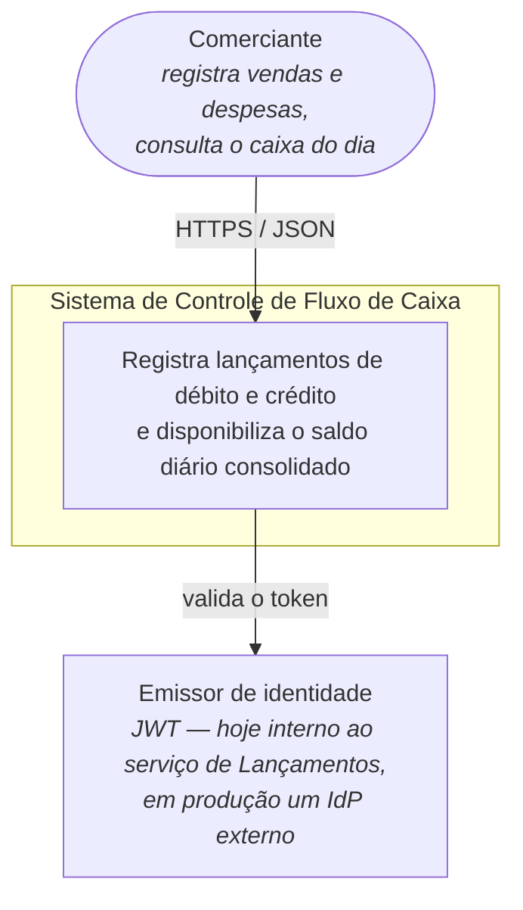
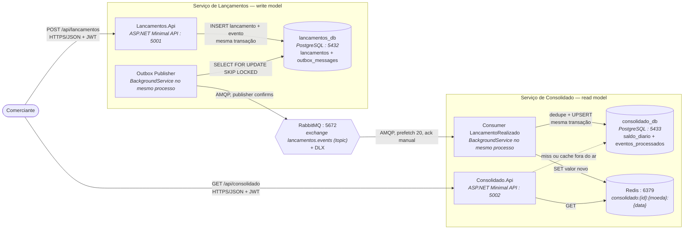
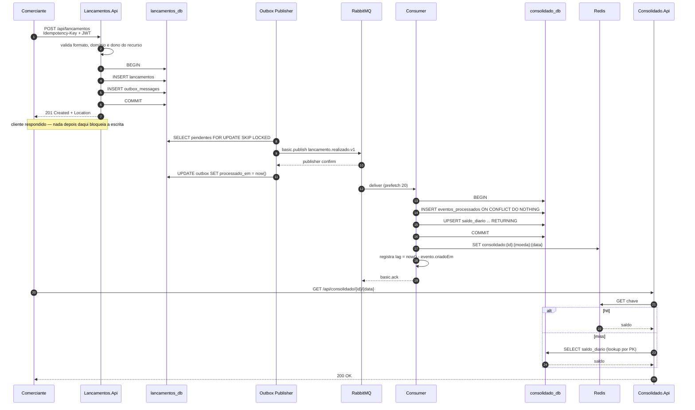
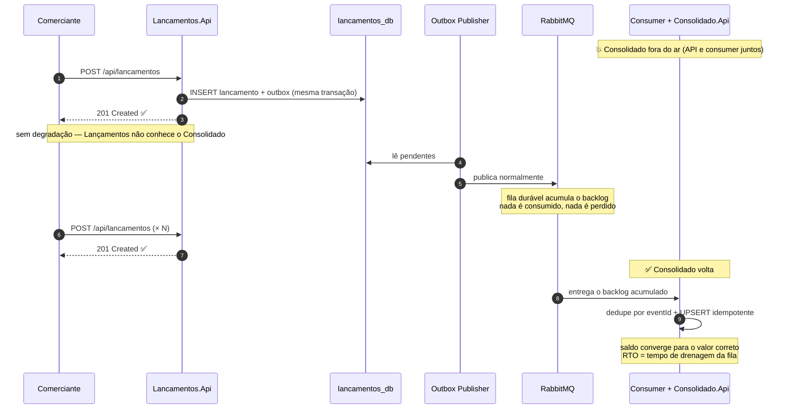
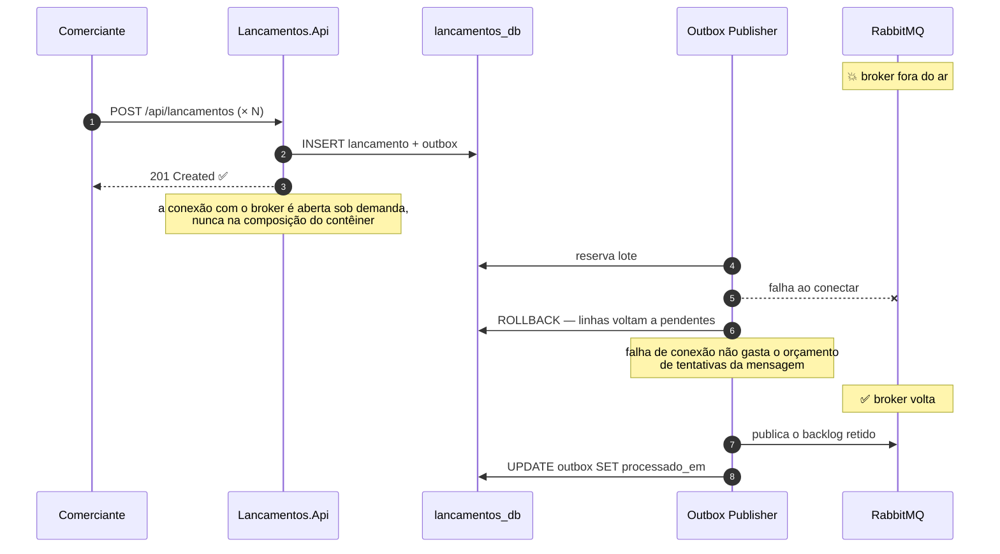

# Arquitetura

Este documento descreve a solução em três níveis: contexto (quem usa e para quê),
contêineres (as unidades que rodam) e fluxo de dados (o que acontece em cada
caminho, incluindo o de falha).

O *porquê* de cada decisão está nos [ADRs](adr/). O modelo de dados e os
contratos de API e de evento estão em
[`modelo-dados-contratos-eventos.md`](modelo-dados-contratos-eventos.md).

---

## 1. A restrição que define o desenho

> **RNF-01 — O serviço de controle de lançamentos não deve ficar indisponível se
> o sistema de consolidado diário cair.**

Os dois casos de uso do sistema — registrar um lançamento e consultar o saldo do
dia — cabem em uma aplicação com duas tabelas. É a restrição acima que não cabe:
ela exige que a falha de um lado seja **estruturalmente incapaz** de alcançar o
outro. Toda decisão registrada aqui é rastreável a ela.

A consequência imediata: nenhuma chamada síncrona de Lançamentos para
Consolidado, em nenhum ponto. A única ligação entre os domínios é uma fila.

---

## 2. C4 — Nível 1: Contexto



O sistema não integra com contabilidade, meio de pagamento ou câmbio. Não há
conversão entre moedas: cada moeda acumula seu próprio saldo, e essa é uma
decisão de escopo declarada, não uma omissão.

---

## 3. C4 — Nível 2: Contêineres



**Seis contêineres, dois processos de aplicação.** A API e o processo em
background de cada serviço rodam juntos: o publisher da outbox dentro do
Lançamentos, o consumer dentro do Consolidado.

Isso é um trade-off consciente, não descuido. Do lado bom: um deploy por
serviço, um `depends_on` a menos e — no Consolidado — derrubar o contêiner
derruba API e consumer de uma vez, o que torna o teste de resiliência mais
forte do que se só a API caísse. Do lado ruim: escalar a leitura escala o
consumer junto, e uma rajada de eventos disputa o thread pool com as consultas.
Separar o consumer em um worker próprio é o primeiro passo se a leitura precisar
de mais réplicas que o consumo.

**A fila é o único ponto de contato.** Não existe seta de Lançamentos para
Consolidado no diagrama, e é isso que torna o RNF-01 estrutural: não há chamada
para falhar, não há timeout para propagar, não há circuit breaker a configurar
entre os dois.

### 3.1 Regra de dependência dentro de cada serviço

```
Api ──> Application ──> Domain
 │                        ▲
 └──> Infrastructure ─────┘
```

`Domain` não referencia nenhum projeto — é o centro, e não tem sequer pacote
NuGet. `Application` e `Infrastructure` dependem só dele. A `Api` referencia
`Infrastructure` **exclusivamente no `Program.cs`**, onde as implementações
concretas são registradas no contêiner de DI; nenhum outro arquivo da API
conhece tipos de infraestrutura.

---

## 4. Fluxo de dados — caminho feliz



Três coisas que o diagrama torna explícitas:

- **O `201` acontece antes de qualquer coisa relacionada ao broker.** A latência
  da escrita não depende do RabbitMQ nem do Consolidado.
- **O cliente nunca fala com o Redis.** O cache é detalhe interno da API de
  consulta, e sua indisponibilidade degrada para o banco em vez de virar erro.
- **Só o consumer escreve no cache.** O caminho de leitura lê e não popula. Se
  populasse, um `SELECT` iniciado antes do commit do consumer poderia gravar o
  valor velho *depois* dele, e o dado errado ficaria preso até o TTL.

---

## 5. Fluxo de dados — Consolidado fora do ar (o requisito âncora)



O `/health/ready` do Lançamentos verifica **apenas o próprio Postgres**. Se
verificasse o RabbitMQ, uma queda do broker faria o serviço se declarar
not-ready, o orquestrador o tiraria do balanceador e as escritas parariam — o
health check derrubaria sozinho o requisito que a outbox existe para garantir.

Este cenário não é argumento: é o teste
`ConsolidadoForaDoArNaoImpedeLancamentoEOSaldoConvergeNaVolta`, executável com
`dotnet test`.

### 5.1 Variante — RabbitMQ fora do ar



Sem a outbox, o broker seria uma dependência síncrona da escrita e um ponto
único de falha para o RNF-01. Este é o benefício menos óbvio do padrão, e é o
segundo teste de resiliência do projeto.

---

## 6. Onde cada garantia é implementada

| Garantia | Mecanismo | Onde |
|---|---|---|
| Escrita sobrevive à queda do Consolidado | ausência de chamada síncrona | topologia |
| Escrita sobrevive à queda do broker | Transactional Outbox | `OutboxRepository` + `UnitOfWork` |
| Nenhum evento perdido | outbox na mesma transação + publisher confirms | `OutboxPublisherBackgroundService` |
| Publisher escala sem duplicar | `FOR UPDATE SKIP LOCKED` | `OutboxRepository` |
| Reentrega não soma duas vezes | `eventos_processados` na mesma transação do UPSERT | `SaldoDiarioRepository.AplicarAsync` |
| Retry do cliente não duplica lançamento | `Idempotency-Key` + índice único por comerciante | `CriarLancamentoCommandHandler` |
| Correção sem `UPDATE`/`DELETE` | lançamento compensatório (estorno) | `Lancamento.Estornar` |
| Banco lento não empilha requisição | circuit breaker + timeout (Polly) | `Consolidado.Infrastructure` |
| Um comerciante não derruba os outros | rate limiting particionado pela claim | `Consolidado.Api/Program.cs` |
| Token válido não lê saldo alheio | `comercianteId` conferido contra a claim | os 6 endpoints de negócio |
| Rastreio ponta a ponta | `correlationId` em escopo de log, propagado no evento | middleware + consumer |
| Preço da consistência eventual medido | histograma de lag no consumer | `Metricas` |
