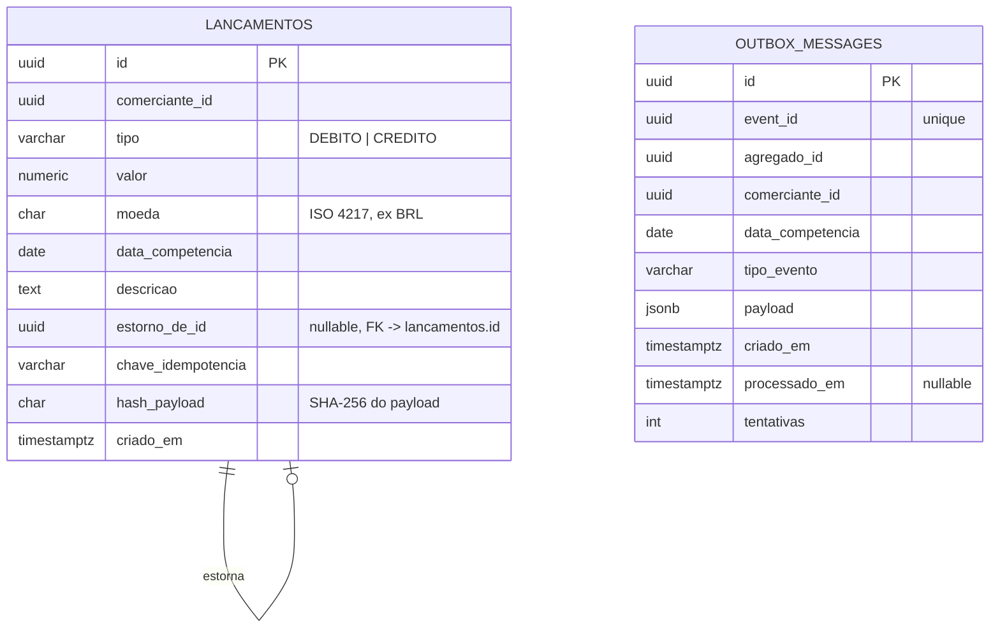
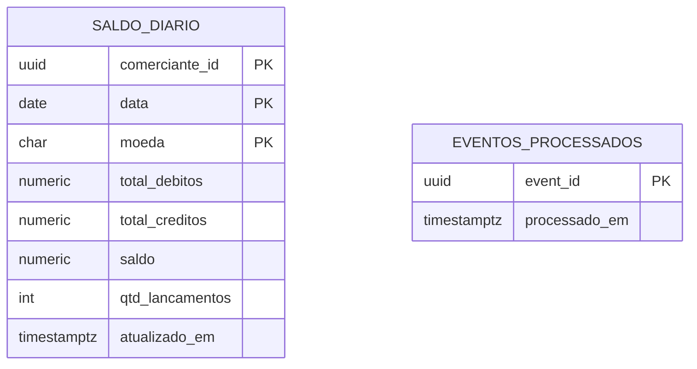

# Modelo de Dados e Contratos — Lançamentos & Consolidado Diário

Antes de codar, este documento fecha quatro coisas que precisam estar alinhadas entre os dois serviços mesmo eles sendo independentes: **o modelo de dados de cada um**, **o contrato do evento** que os conecta, **os contratos das APIs** expostas ao cliente e **as decisões de domínio** que sustentam os dois.

---

## 1. Decisões de modelagem (rápido, antes das tabelas)

- **Multi-comerciante desde já.** O enunciado fala de "um comerciante", mas incluir `comerciante_id` desde o início custa quase zero agora e evita uma migração dolorosa depois. Para o desafio, pode ser tratado como um valor fixo/único, mas o schema já nasce pronto para múltiplos.
- **Dinheiro como `numeric(18,2)` + `moeda` separada**, nunca `float`/`double`. Evita erro de arredondamento no saldo consolidado.
- **Moeda faz parte da chave do saldo.** Saldo consolidado só faz sentido *por moeda* — somar BRL com USD produz um número sem significado. A PK do `saldo_diario` é `(comerciante_id, data, moeda)`. Conversão entre moedas (que exigiria taxa de câmbio da data) está explicitamente fora do escopo.
- **Idempotência nas duas pontas**: chave de idempotência no `POST /lancamentos` (evita duplicar lançamento em retry do cliente) e tabela de eventos processados no Consolidado (evita duplicar soma em retry do broker — RabbitMQ entrega **at-least-once**, nunca *exactly-once*).
- **Versionamento do evento desde o v1** (`"version": 1` no payload) — barato agora, evita quebra de contrato quando o modelo evoluir.
- **Rastreabilidade fim a fim**: todo evento carrega `correlationId`, propagado do header `X-Correlation-Id` da requisição HTTP (ou gerado se ausente) e usado no log estruturado dos dois serviços. É o que permite seguir um lançamento do `POST` até o `UPSERT` do saldo atravessando o broker.

### 1.1 A definição de "dia" (decisão de domínio, não de infraestrutura)

O sistema é de **fluxo de caixa diário**, então "dia" precisa ser definido antes de qualquer tabela:

- O **dia contábil é o dia civil no fuso `America/Sao_Paulo`**, não em UTC.
- `data_competencia` (`DATE`) é o dia ao qual o lançamento pertence — informado pelo cliente, e é ele que agrega o consolidado.
- `criado_em` (`TIMESTAMPTZ`) é o instante físico do registro, sempre em UTC. Serve para auditoria, **nunca** para agregação.
- A validação "data de competência não pode ser futura" compara contra *hoje no fuso do comerciante*, não contra `now()` em UTC.

Sem essa decisão, um lançamento feito às 22h de 24/07 em São Paulo (01:00 UTC de 25/07) cairia no dia errado ou seria rejeitado como futuro. É o bug clássico deste domínio.

### 1.2 Correção de lançamento: estorno, nunca update

O read model do Consolidado é construído por **incrementos** a partir de eventos. Um `UPDATE` ou `DELETE` em `lancamentos` não gera evento de correção e deixaria o saldo permanentemente errado.

A regra é a contábil: **lançamento é imutável**. Corrigir um erro significa registrar um lançamento contrário, referenciando o original (`estorno_de_id`). O saldo se corrige sozinho pelo mesmo caminho de eventos que já existe, sem nenhuma mecânica nova, e a trilha de auditoria fica preservada — que é o comportamento esperado de um livro-caixa.

---

## 2. Serviço de Lançamentos — Modelo de dados



```sql
CREATE TABLE lancamentos (
    id                  UUID PRIMARY KEY DEFAULT gen_random_uuid(),
    comerciante_id      UUID NOT NULL,
    tipo                VARCHAR(10) NOT NULL CHECK (tipo IN ('DEBITO', 'CREDITO')),
    valor               NUMERIC(18,2) NOT NULL CHECK (valor > 0),
    moeda               CHAR(3) NOT NULL DEFAULT 'BRL',
    data_competencia    DATE NOT NULL,
    descricao           TEXT,
    estorno_de_id       UUID NULL REFERENCES lancamentos (id),
    chave_idempotencia  VARCHAR(100) NOT NULL,
    hash_payload        CHAR(64) NOT NULL,   -- SHA-256 do payload da requisição
    criado_em           TIMESTAMPTZ NOT NULL DEFAULT now(),

    -- Idempotência é por comerciante, não global: dois comerciantes podem
    -- legitimamente usar a mesma chave (ex.: "pedido-123").
    CONSTRAINT uq_lancamento_idempotencia UNIQUE (comerciante_id, chave_idempotencia)
);

CREATE INDEX idx_lancamentos_comerciante_data ON lancamentos (comerciante_id, data_competencia);

-- Um lançamento só pode ser estornado uma vez.
CREATE UNIQUE INDEX uq_lancamento_estorno ON lancamentos (estorno_de_id)
    WHERE estorno_de_id IS NOT NULL;

CREATE TABLE outbox_messages (
    id                  UUID PRIMARY KEY DEFAULT gen_random_uuid(),
    event_id            UUID NOT NULL UNIQUE,    -- mesmo eventId do envelope publicado
    agregado_id         UUID NOT NULL,           -- id do lançamento que originou o evento
    comerciante_id      UUID NOT NULL,
    data_competencia    DATE NOT NULL,           -- competência, não data física
    tipo_evento         VARCHAR(100) NOT NULL,
    payload             JSONB NOT NULL,
    criado_em           TIMESTAMPTZ NOT NULL DEFAULT now(),
    processado_em       TIMESTAMPTZ NULL,
    tentativas          INT NOT NULL DEFAULT 0
);

CREATE INDEX idx_outbox_pendentes ON outbox_messages (criado_em) WHERE processado_em IS NULL;

-- Suporta o replay por período de competência (recuperação do read model).
CREATE INDEX idx_outbox_replay ON outbox_messages (comerciante_id, data_competencia);
```

`valor` é sempre positivo — o sinal (`DEBITO`/`CREDITO`) vem do campo `tipo`, não do valor negativo. Evita bug clássico de "esqueci de negativar" no cálculo do saldo. Um estorno de um `CREDITO` é um `DEBITO` de mesmo valor com `estorno_de_id` preenchido.

O `INSERT` em `lancamentos` e o `INSERT` em `outbox_messages` acontecem **na mesma transação** — é isso que garante o Outbox Pattern (ou os dois vão, ou nenhum vai).

### 2.1 Leitura da outbox com múltiplas réplicas

O publisher roda como `BackgroundService` e o serviço escala horizontalmente. Se duas réplicas lerem o mesmo lote, o evento é publicado duas vezes. O dedupe do consumidor corrigiria o saldo, mas depender disso é sorte, não design — a leitura precisa ser exclusiva:

```sql
SELECT id, tipo_evento, payload
FROM outbox_messages
WHERE processado_em IS NULL
  AND tentativas < @maximoTentativas
ORDER BY criado_em
FOR UPDATE SKIP LOCKED
LIMIT @tamanhoLote;
```

O lote é configurável (`RabbitMq:TamanhoLote`, default **50**) e o filtro por
`tentativas` é o que tira a mensagem envenenada da fila de trabalho sem
apagá-la.

`SKIP LOCKED` faz cada réplica pegar um lote disjunto sem bloquear as outras. É a forma canônica de transformar uma tabela em fila de trabalho no Postgres.

A coluna `tentativas` sustenta a política de retry do publisher: incrementa a cada falha de publicação da mensagem e, ao atingir o teto (`OutboxRepository.MaximoTentativas` = 10), a linha deixa de ser selecionada — caso contrário, uma única mensagem impublicável travaria a ordem de tudo que vem depois. É o equivalente da DLQ, do lado do produtor. O **backoff é outra coisa**: ele cresce com as falhas consecutivas do *ciclo* do publisher (tipicamente broker fora do ar), não com a coluna `tentativas`. Backoff por mensagem individual exigiria uma coluna `proxima_tentativa_em`, registrada como evolução futura.

### 2.2 Retenção da outbox = caminho de recuperação

As linhas processadas **não são deletadas**. O custo é baixo (uma linha por lançamento) e o ganho é a única fonte de replay do sistema: se o `consolidado_db` for perdido, ou se um bug somar errado por um período, o read model pode ser reconstruído republicando os eventos da outbox no intervalo afetado.

Para isso a tabela promove três campos que estariam apenas dentro do `payload` a colunas próprias: `event_id`, `comerciante_id` e `data_competencia`. O motivo é específico — o replay precisa recortar por **competência**, não pela data física de gravação. Um lançamento retroativo (gravado hoje, competência de duas semanas atrás) ou o estorno de um lançamento antigo ficariam de fora se o filtro fosse `criado_em`, e a reconstrução produziria um saldo silenciosamente menor que o correto. Extrair de JSONB a cada replay funcionaria, mas colunas indexadas tornam o procedimento trivial e à prova de erro na hora em que ele mais importa: durante um incidente.

Sem isso, o `saldo_diario` é a única cópia do agregado e não há como reconstruí-lo — o que colide diretamente com o requisito de **integridade** e **estratégias de recuperação**. Um expurgo por idade (ex.: mover para tabela histórica após 90 dias) fica como evolução futura.

---

## 3. Serviço de Consolidado — Modelo de dados



```sql
CREATE TABLE saldo_diario (
    comerciante_id      UUID NOT NULL,
    data                DATE NOT NULL,
    moeda               CHAR(3) NOT NULL,
    total_debitos       NUMERIC(18,2) NOT NULL DEFAULT 0,
    total_creditos      NUMERIC(18,2) NOT NULL DEFAULT 0,
    saldo               NUMERIC(18,2) NOT NULL DEFAULT 0,
    qtd_lancamentos     INT NOT NULL DEFAULT 0,
    atualizado_em       TIMESTAMPTZ NOT NULL DEFAULT now(),
    PRIMARY KEY (comerciante_id, data, moeda)
);

-- Dedupe de eventos: se o mesmo event_id chegar de novo (redelivery), o consumer ignora.
CREATE TABLE eventos_processados (
    event_id        UUID PRIMARY KEY,
    processado_em   TIMESTAMPTZ NOT NULL DEFAULT now()
);
```

`saldo_diario` é a **read model** — uma linha por comerciante/dia/moeda, incrementada a cada evento consumido. Não existe uma tabela de "lançamentos" duplicada aqui: o Consolidado nunca precisa saber o detalhe de cada lançamento, só a soma. Isso mantém o read model pequeno e a query de consulta O(1) por chave primária.

`total_debitos` e `total_creditos` são **brutos, não líquidos**. Como estorno é lançamento contrário (§1.2), um crédito de R$ 100 estornado produz `total_creditos = 100`, `total_debitos = 100`, `saldo = 0`, `qtd_lancamentos = 2`. O saldo fica correto, mas os totais não representam "vendas" e "despesas" do dia — representam movimentação bruta. É a semântica contábil correta, e precisa estar dita para não ser lida como bug pelo consumidor da API.

`moeda` faz parte da PK porque saldo consolidado só existe *dentro de uma moeda*. Sem essa coluna, um comerciante que operasse em BRL e USD teria os dois somados na mesma linha, produzindo um número sem significado contábil.

`qtd_lancamentos` é barato de manter e serve como métrica de integridade: comparado com o `COUNT` do serviço de Lançamentos no mesmo período, detecta divergência entre write model e read model sem precisar recalcular tudo.

### 3.1 Update atômico ao consumir o evento

```sql
INSERT INTO saldo_diario (comerciante_id, data, moeda,
                          total_debitos, total_creditos, saldo,
                          qtd_lancamentos, atualizado_em)
VALUES (@comercianteId, @data, @moeda,
        @debito, @credito, @saldo,
        1, now())
ON CONFLICT (comerciante_id, data, moeda) DO UPDATE SET
    total_debitos   = saldo_diario.total_debitos  + EXCLUDED.total_debitos,
    total_creditos  = saldo_diario.total_creditos + EXCLUDED.total_creditos,
    saldo           = saldo_diario.saldo + EXCLUDED.saldo,
    qtd_lancamentos = saldo_diario.qtd_lancamentos + 1,
    atualizado_em   = now()
RETURNING total_debitos, total_creditos, saldo, qtd_lancamentos, atualizado_em;
```

Dois detalhes da implementação real. Os três parâmetros `@debito`, `@credito` e
`@saldo` são derivados do tipo em C# (`Movimento.De`), não por `CASE WHEN` no
SQL: a regra de que débito subtrai é de domínio e fica testável sem banco. E o
`RETURNING` evita um `SELECT` depois do `UPSERT` — o consumer já sai da mesma
ida ao banco com o saldo consolidado que vai gravar no cache.

Um `UPSERT` (`INSERT ... ON CONFLICT`) só — sem "ler saldo atual, somar em memória, gravar de volta". Isso evita race condition entre consumers concorrentes sem precisar de lock explícito.

### 3.2 Transação do consumer

O `INSERT` em `eventos_processados` e o `UPSERT` em `saldo_diario` acontecem **na mesma transação local**. Se o dedupe fosse gravado fora dela, uma falha entre as duas operações produziria evento marcado como processado sem o saldo atualizado (perda silenciosa) ou saldo somado duas vezes em redelivery.

```sql
BEGIN;

INSERT INTO eventos_processados (event_id)
VALUES (@eventId)
ON CONFLICT DO NOTHING;      -- retorna 0 linhas se já foi processado

-- se rowsAffected == 0 → duplicata: COMMIT (ou ROLLBACK) e ack, sem tocar no saldo
-- se rowsAffected == 1 → evento novo: executa o UPSERT de §3.1

COMMIT;
```

O `ON CONFLICT DO NOTHING` é obrigatório aqui, e não um detalhe de estilo: no PostgreSQL, deixar a violação de PK estourar **aborta a transação inteira**, e nada mais pode ser executado nela — inclusive o `COMMIT` que confirmaria o processamento. Tratar duplicata via exceção capturada só funcionaria com `SAVEPOINT`, que é mais caro e mais frágil. Checar `rowsAffected` mantém o caminho de duplicata livre de exceções, que é justamente o caminho mais frequente em redelivery.

### 3.3 Crescimento das tabelas auxiliares

`eventos_processados` cresce na mesma taxa dos lançamentos e nunca é lida a não ser pela PK. Expurgo por idade (ex.: remover registros com mais de 30 dias, muito além de qualquer janela de redelivery do broker) fica como evolução futura, mas precisa estar registrado — tabela de dedupe que cresce para sempre é dívida operacional silenciosa. O mesmo vale para `outbox_messages`, com a diferença de que ali a retenção é intencional (§2.2) e o expurgo significa mover para tabela histórica, não deletar.

---

## 4. Contrato do evento — `LancamentoRealizado`

Publicado pela Outbox do serviço de Lançamentos, consumido pelo Consolidado.

- **Broker:** RabbitMQ
- **Exchange:** `lancamentos.events` (tipo `topic`)
- **Routing key:** `lancamento.realizado.v1`
- **Fila do consumidor:** `consolidado.lancamento-realizado` (durável)
- **Dead-letter exchange:** `lancamentos.events.dlx` → fila `consolidado.lancamento-realizado.dlq`. O `nack` sem requeue acontece na **primeira** entrega, e só para payload que não melhora sozinho (malformado ou inválido). Falha de ambiente — banco fora do ar — usa `nack` **com** requeue, e a mensagem volta para a fila. Não há teto de reentregas nesta versão: é dívida conhecida, registrada no [runbook](runbook.md)
- **Garantia:** at-least-once. Publisher confirms no lado do produtor, `ack` manual após commit no lado do consumidor.

```json
{
  "eventId": "b2a1e2d0-1234-4a5b-9c3d-abcdef123456",
  "version": 1,
  "eventType": "LancamentoRealizado",
  "occurredAt": "2026-07-24T14:32:10.115+00:00",
  "correlationId": "7c9e6679-7425-40de-944b-e07fc1f90ae7",
  "agregadoId": "f47ac10b-58cc-4372-a567-0e02b2c3d479",
  "comercianteId": "9e107d9d-372b-4c14-b1c1-9e1a2f0f1a11",
  "dataCompetencia": "2026-07-24",
  "lancamentoId": "f47ac10b-58cc-4372-a567-0e02b2c3d479",
  "tipo": "CREDITO",
  "valor": 150.00,
  "moeda": "BRL",
  "estornoDeId": null,
  "criadoEm": "2026-07-24T14:32:10.115Z"
}
```

O payload é **plano**, não com um objeto `data` aninhado. A separação envelope/payload é a convenção mais comum e faz sentido quando um consumidor precisa rotear por `eventType` sem conhecer o formato interno — mas com um único tipo de evento ela só adiciona um nível de indireção. A chave de roteamento fica fora do JSON: roteamento é decisão de infraestrutura, não parte do contrato de dados.

`eventId` é a chave de dedupe usada na tabela `eventos_processados`. `correlationId` é propagado do header HTTP da requisição original e permite rastrear o lançamento fim a fim nos logs dos dois serviços. `version` permite evoluir o payload (ex.: `v2` adicionando um campo) sem quebrar consumidores antigos — o consumer decide como tratar por versão.

`criadoEm` carrega o instante da escrita no serviço de Lançamentos e existe por um motivo específico: é o que torna o **lag de consistência eventual mensurável**. Como os dois serviços têm bancos separados, ninguém consegue comparar o `criado_em` do lançamento com o `atualizado_em` do saldo por query. Levando o timestamp de origem dentro do evento, o consumer calcula `lag = now() - criadoEm` no momento do `UPSERT` e emite a métrica. Sem esse campo, o SLO mais importante do projeto seria apenas uma intenção declarada.

O estorno **não é um tipo de evento novo**: é um `LancamentoRealizado` com `tipo` invertido e `estornoDeId` preenchido. O consumidor não precisa de nenhum tratamento especial — a soma se corrige sozinha. Essa é a vantagem de modelar correção como lançamento compensatório em vez de mutação.

---

## 5. Contratos de API (HTTP)

Todos os endpoints exigem `Authorization: Bearer <jwt>`. Aceitam opcionalmente `X-Correlation-Id`; se ausente, o servidor gera um e devolve no response.

### 5.1 Autorização — regra que vale para todos os endpoints

O `comercianteId` que aparece na rota ou no body **nunca é confiado**. Ele é comparado com a claim `comerciante_id` do token, e divergência retorna `403 Forbidden`.

Sem essa verificação, `GET /api/consolidado/{comercianteId}/{data}` permite que qualquer portador de token válido leia o saldo de qualquer comerciante — uma falha de autorização a nível de objeto (IDOR). Autenticar sem autorizar por recurso é o erro mais comum em API multi-tenant.

### 5.2 `POST /api/lancamentos` (serviço de Lançamentos)

Header obrigatório: `Idempotency-Key: <guid>` — protege contra duplo clique / retry do cliente.

**Request**
```json
{
  "comercianteId": "9e107d9d-372b-4c14-b1c1-9e1a2f0f1a11",
  "tipo": "CREDITO",
  "valor": 150.00,
  "moeda": "BRL",
  "dataCompetencia": "2026-07-24",
  "descricao": "Venda balcão"
}
```

**Response `201 Created`**
```json
{
  "id": "f47ac10b-58cc-4372-a567-0e02b2c3d479",
  "comercianteId": "9e107d9d-372b-4c14-b1c1-9e1a2f0f1a11",
  "tipo": "CREDITO",
  "valor": 150.00,
  "moeda": "BRL",
  "dataCompetencia": "2026-07-24",
  "descricao": "Venda balcão",
  "estornoDeId": null,
  "criadoEm": "2026-07-24T14:32:10Z"
}
```

A validação nativa de Minimal APIs do .NET 10 (`AddValidation()`, baseada em DataAnnotations) cobre o que é formato: `valor > 0` via `[Range]`, `tipo` ∈ {DEBITO, CREDITO} via `[AllowedValues]`, campos obrigatórios e tamanho. A validação de **moeda ISO 4217 não é nativa** — não existe atributo pronto para isso. O DTO valida só o formato (`[StringLength(3, MinimumLength = 3)]`) e a allowlist de moedas suportadas fica no VO `Moeda`, do domínio: é regra de negócio, não de formato, e é o domínio que decide o que o sistema sabe tratar.

A regra `dataCompetencia <= hoje` não é validação de formato e sim de **domínio**: depende do fuso do comerciante (§1.1) e fica como Guard Clause na entidade, não como anotação no DTO. Retorno de erro em ambos os casos: `400` com `ProblemDetails` padrão.

**Comportamento da idempotência:**

| Situação | Resposta |
|---|---|
| Chave nova | `201 Created` com o lançamento criado |
| Chave repetida, **mesmo** payload | `200 OK` com o lançamento original (sem duplicar) |
| Chave repetida, payload **diferente** | `409 Conflict` — a chave já identifica outro recurso |
| Header ausente | `400 Bad Request` |

O caso de `409` importa: devolver silenciosamente o recurso antigo quando o cliente mandou dados diferentes esconde um bug do cliente e produz divergência que ninguém detecta.

Distinguir os dois casos exige guardar algo do payload original — só a chave não basta. Daí a coluna `hash_payload`: um SHA-256 do corpo canonicalizado da requisição, gravado junto do lançamento. Na chegada de uma chave repetida, compara-se o hash; igual devolve o recurso existente com `200`, diferente devolve `409`. Guardar o hash em vez do payload inteiro custa 64 bytes fixos e evita duplicar no banco um dado que já está nas colunas da própria tabela.

### 5.3 `POST /api/lancamentos/{id}/estorno?comercianteId=` (serviço de Lançamentos)

Cria o lançamento compensatório do lançamento `{id}` (§1.2). Também exige `Idempotency-Key`. O `comercianteId` é query param **obrigatório** — é ele que vai ao `WHERE` da consulta e é conferido contra a claim do token.

**Response `201 Created`** — mesmo formato do `POST /api/lancamentos`, com `tipo` invertido e `estornoDeId` preenchido.

| Situação | Resposta |
|---|---|
| Lançamento não existe / de outro comerciante | `404` / `403` |
| Lançamento já estornado | `409 Conflict` |
| É ele próprio um estorno | `422 Unprocessable Entity` |

### 5.4 `GET /api/lancamentos` e `GET /api/lancamentos/{id}` (serviço de Lançamentos)

Query params da listagem: `comercianteId`, `dataInicio` e `dataFim` são **obrigatórios** — chegam como `Guid` e `DateOnly` não-anuláveis, então a falta de qualquer um vira `400` já na ligação de parâmetros, **antes** da checagem de dono; `pagina` (default 1) e `tamanhoPagina` (default 50, máximo 200) são opcionais. Uma consequência de ordem que vale registrar: uma requisição para o comerciante errado **sem** as datas responde `400`, não `403`. Não vaza nada — só significa que a validação de formato roda antes da autorização. Sem este endpoint o serviço é write-only — o comerciante não consegue conferir o que lançou, e o avaliador não consegue inspecionar o estado sem abrir o banco.

A consulta por id é `GET /api/lancamentos/{id}?comercianteId=`, e o query param também é obrigatório aqui. Responde `200` com o mesmo corpo do `POST` (§5.2), `404` se o id não existe e `403` se o comerciante diverge da claim. É para essa URL — **com** o `comercianteId` — que aponta o header `Location` do `201`: um `Location` que devolve `400` ao ser seguido é um contrato quebrado, ainda que o recurso exista.

Ordenação da listagem: `data_competencia DESC, id DESC`. A data sozinha não é única e produziria paginação instável — registros do mesmo dia poderiam aparecer duas vezes ou sumir entre páginas. O id como desempate torna a ordem total.

### 5.5 `GET /api/consolidado/{comercianteId}/{data}` (serviço de Consolidado)

**Response `200 OK`** (cache hit no Redis ou fallback no Postgres)
```json
{
  "comercianteId": "9e107d9d-372b-4c14-b1c1-9e1a2f0f1a11",
  "data": "2026-07-24",
  "moeda": "BRL",
  "totalDebitos": 320.50,
  "totalCreditos": 700.00,
  "saldo": 379.50,
  "qtdLancamentos": 12,
  "atualizadoEm": "2026-07-24T14:32:11Z"
}
```

**Response `200 OK`** sem lançamentos no dia ainda (saldo zerado, não é erro):
```json
{
  "comercianteId": "9e107d9d-372b-4c14-b1c1-9e1a2f0f1a11",
  "data": "2026-07-24",
  "moeda": "BRL",
  "totalDebitos": 0,
  "totalCreditos": 0,
  "saldo": 0,
  "qtdLancamentos": 0,
  "atualizadoEm": null
}
```

Query param opcional `moeda` (default `BRL`). `atualizadoEm` não é decoração: é o que permite ao cliente saber **quão fresco** é o dado, já que a consistência é eventual — o cliente decide se aceita ou se reconsulta. Ele **não** é a base do SLI de lag: esse número é calculado no consumer a partir do `criadoEm` que vem no evento (§4), porque `atualizado_em` é sobrescrito por cada evento seguinte e não corresponde a nenhum lançamento específico.

### 5.6 `GET /api/consolidado/{comercianteId}?de={data}&ate={data}` (serviço de Consolidado)

O enunciado pede um **relatório** de saldo diário consolidado — uma consulta de data única é o mínimo, um período é o que caracteriza o relatório. O read model já suporta: é um range scan na PK, sem custo adicional de modelagem.

**Response `200 OK`**
```json
{
  "comercianteId": "9e107d9d-372b-4c14-b1c1-9e1a2f0f1a11",
  "moeda": "BRL",
  "de": "2026-07-01",
  "ate": "2026-07-24",
  "dias": [
    { "data": "2026-07-01", "totalDebitos": 100.00, "totalCreditos": 450.00, "saldo": 350.00, "qtdLancamentos": 7, "atualizadoEm": "2026-07-01T23:58:02Z" },
    { "data": "2026-07-02", "totalDebitos": 80.00,  "totalCreditos": 120.00, "saldo": 40.00,  "qtdLancamentos": 3, "atualizadoEm": "2026-07-02T19:14:47Z" }
  ],
  "saldoDoPeriodo": 390.00
}
```

Cada item de `dias` tem exatamente o mesmo formato do `GET` de data única (§5.5) — mesmo recurso, mesma representação, inclusive `comercianteId` e `moeda`, que se repetem em cada item. A repetição é redundante no envelope, mas mantém o item autocontido: um cliente que fatia a lista não precisa carregar o contexto junto. `saldoDoPeriodo` é a soma dos saldos diários do intervalo; deliberadamente **não** se chama "acumulado", porque não incorpora saldo de abertura anterior a `de` — o sistema não modela saldo de abertura.

Período máximo de 90 dias (`400` acima disso) — limite explícito evita que uma consulta acidental de 10 anos vire um incidente de disponibilidade.

**Cache:** este endpoint **não é cacheado como resposta inteira.** A chave de invalidação do consumer é por dia (§5.9), então uma resposta de período ficaria órfã de qualquer mecanismo de invalidação e serviria dado velho indefinidamente. A resposta é composta a partir das chaves diárias (que têm invalidação) ou direto do banco — um range scan na PK é barato o bastante para não justificar uma segunda camada de cache com semântica de invalidação diferente.

### 5.7 Resposta sob degradação

O orçamento de 5% de perda só é uma decisão arquitetural se o comportamento da perda estiver especificado:

| Situação | Resposta |
|---|---|
| Rate limit atingido | `429 Too Many Requests` + `Retry-After` |
| Circuit breaker aberto (banco indisponível/lento) | `503 Service Unavailable` + `Retry-After` + `ProblemDetails` |
| Timeout na consulta | `504 Gateway Timeout` |

Falhar rápido e explicitamente é o que mantém a perda dentro do orçamento; o que estoura o SLO é empilhar requisições até o serviço parar de responder por inteiro.

### 5.8 Health checks

| Endpoint | Verifica | Uso |
|---|---|---|
| `/health/live` | processo respondendo | liveness probe — reinicia o container |
| `/health/ready` | + o **próprio** Postgres acessível | readiness probe — tira do load balancer |

A distinção importa para o requisito âncora: o Consolidado ficar `not ready` **não pode** deixar o Lançamentos `not ready`. Os dois têm probes independentes porque não compartilham dependências.

O readiness verifica **só o próprio Postgres**, deliberadamente — nem broker, nem Redis. Se o `/health/ready` do Lançamentos dependesse do RabbitMQ, uma queda do broker faria o serviço se declarar not-ready, o orquestrador o tiraria do balanceador e as escritas parariam: o health check derrubaria sozinho o RNF-01 que a outbox existe para garantir. Readiness não é diagnóstico de dependências, é a resposta a "devo continuar recebendo tráfego?" — e com o broker fora a resposta é **sim**.

### 5.9 Cache — chave e política

**Chave Redis:** `consolidado:{comercianteId}:{moeda}:{data}` — a chave efetiva no servidor é `cashflow:consolidado:{comercianteId}:{moeda}:{data}`, porque o `IDistributedCache` está configurado com `InstanceName = "cashflow:"` e prefixa tudo que grava. É o prefixo que o comando de invalidação manual do runbook precisa casar.

**Mecanismo primário: invalidação ativa.** Após cada `UPSERT`, o consumer sobrescreve a chave com o valor novo (`SET`, não `DEL`). Usar `SET` em vez de `DEL` evita a race clássica: com `DEL`, um leitor que buscou no banco antes da escrita pode repopular o cache com o valor antigo *depois* da invalidação, e o dado errado fica preso até o TTL expirar.

**TTL como rede de segurança**, diferenciado por natureza do dado:

| Dado | TTL | Por quê |
|---|---|---|
| Dia corrente | 5 s | muda a cada lançamento; TTL curto limita a defasagem |
| Dia passado | 5 min | muda raramente, mas **não é imutável** |

A distinção importa e é fácil de errar: seria tentador dar TTL de horas ao dia passado alegando que "dia fechado não muda". **Não é verdade neste modelo.** A validação aceita `dataCompetencia <= hoje`, ou seja, lançamentos retroativos são permitidos; e o estorno de um lançamento antigo (§5.3) gera um evento com `dataCompetencia` no passado. Um TTL de 12 h serviria saldo histórico errado por até 12 h sempre que a invalidação ativa falhasse (Redis reiniciado, chave perdida, consumer com erro).

Os 5 minutos são o compromisso: capturam quase todo o benefício de cache das consultas de relatório histórico — que é onde o cache mais rende — sem transformar uma falha de invalidação em meio dia de dado errado. Se o requisito de negócio passasse a proibir lançamento retroativo além de N dias, aí sim o dia fechado viraria genuinamente imutável e o TTL longo se justificaria.

---

## 6. O que isso implica nos projetos

| Projeto | Conteúdo principal |
|---|---|
| `Lancamentos.Application` | `CriarLancamentoCommand` / `EstornarLancamentoCommand` + handlers — valida chave de idempotência, chama o Domain, grava lançamento + outbox na mesma transação via `ILancamentoRepository`/`IOutboxWriter` |
| `Lancamentos.Domain` | Entidade `Lancamento` (com regra de estorno), VO `Dinheiro` (Valor + Moeda), enum `TipoLancamento`, interface `ILancamentoRepository`, interface `IOutboxWriter`, regras (`valor > 0`, `dataCompetencia <= hoje` no fuso do comerciante, estorno único) |
| `Lancamentos.Infrastructure` | `LancamentoRepository` (Dapper), `OutboxRepository` (Dapper, com `SKIP LOCKED`), `OutboxPublisherBackgroundService` |
| `Consolidado.Application` | `ObterSaldoDiarioQuery` / `ObterSaldoPeriodoQuery` + handlers — chamam `ISaldoDiarioRepository` e **não sabem que existe cache**, que é o ponto: o cache-aside vive dentro do adaptador |
| `Consolidado.Domain` | Entidade `SaldoDiario`, VO `Movimento`, interface `ISaldoDiarioRepository`. **Não** existe uma interface separada de dedupe: gravar o `eventId` e somar são uma operação atômica só, e separá-las em duas colaborações convidaria alguém a chamá-las fora da mesma transação |
| `Consolidado.Infrastructure` | `SaldoDiarioRepository` (Dapper + UPSERT acima, com o cache-aside embutido sobre `IDistributedCache`), `LancamentoRealizadoConsumer` (dedupe + upsert na mesma transação) |

A `Api` de cada serviço fica só com o endpoint mapeando request → handler e devolvendo o resultado, mais a verificação de autorização por comerciante (§5.1) — nenhuma regra de negócio ou acesso a dado na camada Api.

**Nota sobre o dispatcher:** o padrão Command/Query aqui é implementado com interfaces próprias (`ICommandHandler<TCommand, TResult>` / `IQueryHandler<TQuery, TResult>`) registradas no `IServiceCollection` nativo — cerca de 30 linhas. A alternativa seria MediatR; a decisão de não usá-lo (versão recente sob licença comercial, e o padrão é mais bem demonstrado implementado que importado) está registrada em ADR.

---

## 7. Bootstrap do schema e da topologia

Ponto pequeno com impacto desproporcional: é exatamente aqui que um `docker compose up` quebra na máquina de quem avalia. Os DDLs acima e a topologia do broker precisam de um dono explícito.

**Schema dos bancos.** Como a persistência é Dapper (sem migrations do EF), cada serviço leva um `init/01-schema.sql` montado em `/docker-entrypoint-initdb.d/` da respectiva imagem do Postgres — o entrypoint oficial executa tudo que estiver nessa pasta na primeira inicialização do volume. Simples, sem dependência nova, e o DDL fica versionado no repositório junto do serviço que o possui. A ressalva a documentar: só roda com volume vazio; evoluir schema depois exige `docker compose down -v`. Para produção, a resposta seria uma ferramenta de migração (DbUp ou Flyway), e isso vai como evolução futura.

**Topologia do RabbitMQ.** Exchanges (`lancamentos.events` e a DLX), filas e bindings são provisionados por **`infra/rabbitmq/definitions.json`**, carregado no boot do broker via `load_definitions`. É o equivalente ao `/docker-entrypoint-initdb.d/` usado nos bancos: topologia declarativa, versionada, aplicada antes de qualquer serviço subir.

A alternativa considerada era declarar a topologia no código dos serviços, de forma idempotente. Ela tem uma vantagem real — o serviço fica **autossuficiente**, funcionando contra qualquer broker — e foi descartada por reduzir a superfície de API do cliente AMQP num ponto do projeto em que essa era a principal incerteza técnica.

**Consequência assumida:** o serviço depende de provisionamento externo. Apontá-lo para um broker não provisionado por este compose faz as mensagens serem **descartadas em silêncio** — o broker não erra ao publicar numa exchange sem binding, apenas descarta. Vale registrar que o `mandatory: true` da publicação **não** cobre esse caso: com confirmação de publicador ligada, uma mensagem sem rota é confirmada normalmente e devolvida por um evento assíncrono separado; sem tratar `BasicReturn`, ela some do mesmo jeito. Tratar esse retorno é o primeiro item a acrescentar caso o sistema passe a rodar contra broker compartilhado. Ver ADR 0004.

Consequência prática: a ordem de subida no compose não importa, desde que cada serviço tenha retry na conexão inicial — outro detalhe que costuma ser a diferença entre "subiu de primeira" e "subiu na segunda tentativa".

---

## 8. Invariantes do sistema (o que os testes devem garantir)

Resumo do que precisa ser sempre verdade — cada linha vira um teste:

1. `valor > 0` sempre; o sinal vem de `tipo`.
2. `saldo = total_creditos - total_debitos`, por comerciante/dia/moeda.
3. Todo lançamento gravado tem exatamente uma linha na outbox (mesma transação).
4. Reprocessar o mesmo `eventId` não altera o saldo (idempotência do consumer).
5. Repetir a mesma `Idempotency-Key` com o mesmo payload não cria lançamento novo.
6. `qtd_lancamentos` do Consolidado converge para o `COUNT` do Lançamentos no mesmo período.
7. **Com o Consolidado fora do ar, `POST /api/lancamentos` continua retornando `201`** — e o saldo converge quando ele volta.

A sétima é o requisito âncora do desafio, e é a que deve ter um teste de integração dedicado.

---

*Próximo passo natural: scaffold dos dois solutions com esses contratos já implementados.*
